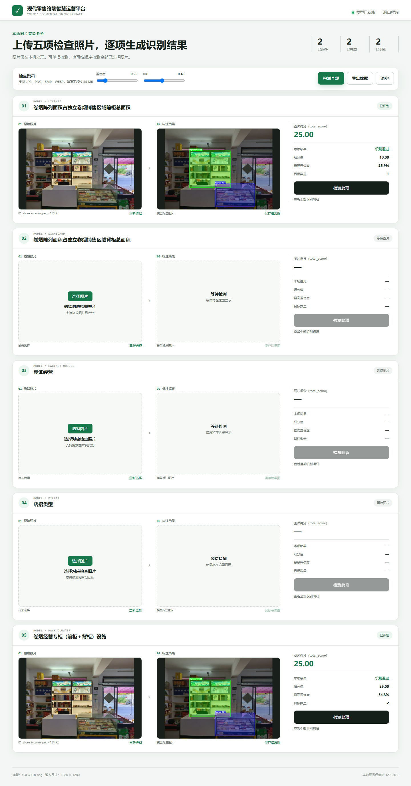

# 005 零售终端视觉巡检 | Retail Vision

> 把门店检查图片变成检测框、分割结果、计分和可交付报告。
>
> **English:** A practical, runnable project with a documented workflow for the problem described above.

## 项目展示 / Demo

## 解决什么问题 / Problem

解决人工巡店检查耗时、标准不一致以及结果难以留痕的问题。

**English:** This project addresses the problem above with a reproducible local workflow.

## 有什么用 / Use

上传一张或多张门店图片，系统在本地完成 YOLO 检测/分割、规则计分和结果导出。

**English:** Run the workflow locally, inspect the output, and extend the project from the provided source.

## 高光亮点 / Highlights

- 五类检查项和组合识别规则
- YOLO11n-seg ONNX CPU 推理
- 结果图、类别、置信度和目标数量
- Win7/Win11 EXE 与精确回归测试

## 技术名词 / Tech

`HTML · JavaScript · Python · OpenCV · NumPy · ONNX Runtime · PyInstaller`

## 从 ZIP 开始复现 / Reproduce from ZIP

1. 下载 ZIP 并解压。
2. 安装 requirements-win7.txt 中的 Python 依赖。
3. 执行 python app_win7/launcher.py，浏览器打开本地地址。
4. 上传 diagnostics 中的测试图片，查看标注图和分数。
5. Windows 用户也可以按 build_win7.ps1 和 package_win7.ps1 构建 EXE。

**Expected result:** 页面显示每项检查结果、检测框/分割区域和总分；五张回归图片可用于快速复核。

## 目录提示 / Notes

- 先阅读本 README，再按项目内更详细的中文/英文文档补充配置。
- 不要把真实密码、Token、数据库业务数据和本机运行结果提交回仓库。
- 下载 ZIP 后的第一次运行应使用测试数据或示例图片，确认链路正常后再接入自己的环境。

[English documentation](README.en.md)
